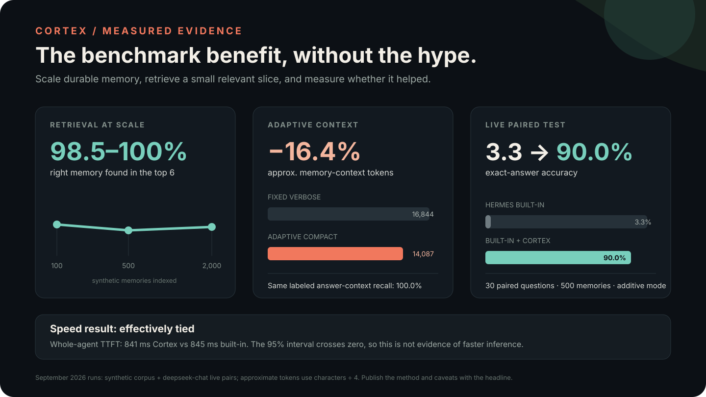
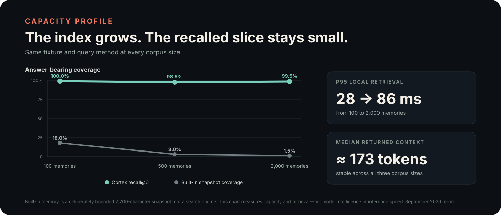
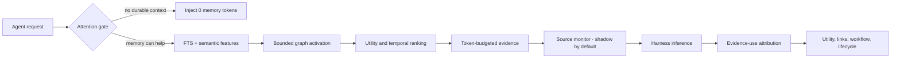

# Cortex Memory

**Memory that earns its place.** `cortex-memory` is a local-first, psychology-inspired memory core for agent harnesses. It recalls bounded evidence, learns which memories and tool workflows actually help, preserves corrections, consolidates offline, and cools stale information without deleting history.

The core is harness-neutral. A small Python API handles durable writes, recall batches, evidence-use feedback, episodes, audit, and Cortex Sleep. [Hermes Agent](https://github.com/NousResearch/hermes-agent) is the first included adapter and the current reference benchmark—not a requirement for the storage, retrieval, lifecycle, dashboard, or Sleep engine.

Cortex is an engineering system, not a simulated brain. Psychology and neuroscience provide hypotheses; transparent benchmarks decide whether the software helps.



## Evidence at a glance

| Question | Measured result | What it means |
| --- | --- | --- |
| Can it find memory at scale? | **98.5–99.5% recall@6** from 100 to 2,000 synthetic memories. | The relevant fact was almost always in Cortex's first six results. |
| Does adaptive recall reduce Cortex context? | **21.7% fewer** approximate memory-context tokens than fixed verbose Cortex, with the same 93.3% labeled answer availability. | The attention gate and compact format avoided unnecessary memory text in this workload. |
| Did answers improve in a live paired run? | **6.7% → 96.7% exact-answer accuracy** across 90 pairs in additive mode. | Cortex made the labeled answer available; the built-in bounded snapshot usually could not hold it. |
| Is inference proven faster? | **No clear latency difference.** TTFT was 1,339 ms with Cortex and 1,337 ms built-in; the confidence interval crossed zero. | The proven benefit is memory capacity and answer availability, not raw model speed—yet. |



These are reproducible synthetic benchmarks, not a promise about every agent or vault. The live accuracy comparison uses the Hermes reference adapter, intentionally tests beyond its built-in snapshot's capacity, and used 51.8% more median prompt tokens in that run to supply the missing evidence. Read the [method, raw results, and required caveats](docs/BENCHMARKING.md), then run representative tests on your own harness and history.

## Why Cortex

Most agent memory systems optimize only for storing and finding text. Cortex also asks:

- Did this request need memory at all?
- Was the recalled memory actually used?
- Did it help, fail, or later prove wrong?
- Which memories are related or superseded?
- Which tool sequence has worked across multiple distinct tasks?
- Can a stale-memory decision be reversed?

The result is a bounded evidence layer that an agent harness can call, plus a Brain dashboard that makes its behavior inspectable and can optionally enable narrowly scoped, confirmed memory reviews.

## What 0.2 adds

- **Attention-gated recall:** `none`, `lean`, `focused`, `procedural`, and `deep` modes vary the memory count, token budget, graph depth, and tool evidence by request.
- **Transparent hybrid retrieval:** SQLite FTS5 precision plus dependency-free semantic features and bounded personalized graph activation. No embedding API or pre-inference LLM call.
- **Temporal recall:** current questions demote superseded facts; historical questions can retrieve the memory valid at a requested time.
- **Evidence-use attribution:** structured values, distinctive anchors, lexical evidence, and capped conceptual similarity prevent every retrieval from being rewarded.
- **Workflow learning:** Cortex learns repeated multi-step tool paths, not only single-tool success counts, and requires evidence from distinct tasks.
- **Reversible consolidation:** safe near-duplicates can fold behind a canonical memory and later be restored.
- **Adaptive lifecycle:** retention considers importance, confidence, trust, utility, uniqueness, frequency, and harm—not age alone.
- **Pruning-regret detection:** archived evidence can be surfaced in shadow mode or restored automatically.
- **Cognition dashboard:** live recall latency, estimated context tokens, abstention, lifecycle changes, tool workflows, and scientific field notes.

## What is developing on `testing`

Cortex 0.3 begins the measurement-and-efficiency cycle. The current testing build adds:

- **Outcome-driven context budgets:** Cortex holds its default until it has enough resolved evidence, then cautiously spends less on repeatedly ignored or harmful context and slightly more when helpful context is consistently saturated.
- **Safe retrieval caching:** short-lived results can be reused after repeated queries, while every turn still records retrieval, selection, injection, and use. Material memory, graph, or tool-guidance changes invalidate the cache across database connections.
- **Private real-history evaluation:** operators can label their own memories locally and export a sanitized retrieval report without publishing queries, memory text, IDs, or database paths.
- **Paired tool-call evaluation:** recorded observations or explicit live provider fixtures compare tool choice, argument shape, task success, latency, and tokens without executing arbitrary tools.
- **Release automation:** Python 3.10–3.14 CI now covers unit tests, clean install, in-place upgrade, schema migration, syntax, public-file privacy, and SVG validation.
- **Cortex Sleep:** a nightly offline replay cycle reviews older sessions and resolved outcomes, requires independent witnesses before proposing associations, surfaces interference, previews maintenance, and records every decision for the dashboard.
- **Controlled learning lab:** randomized adaptive/fixed/no-memory tasks, matched reversible Sleep trials, explicit agent-level outcomes, a failure explorer, cited summary approval, prospective-memory states, and reconsolidation follow-through share one local task/evidence ledger.
- **Budgeted idle reflection:** optional model review can spend a separate per-run token ceiling on evidence-linked proposals. It is off by default, normally billed, privacy-sensitive, and never applies its own conclusions.
- **Silent automatic admission judge:** an explicit remote-data-egress opt-in can enable a clock-aligned five-minute systemd timer that asks a bounded LLM batch to keep, file as evidence, reject, defer, or request context for staged creation proposals. Decisions are strictly validated, honestly labeled `AUTOMATIC_APPROVED`, atomically audited, reversible, and never hard-delete data or notify the user. Unambiguous later outcome feedback raises only the preceding assistant turn's candidate signal without crediting generic thanks or unrelated user-authored candidates, and never bypasses safety guards. See [Automatic memory judge](docs/AUTO_JUDGE.md).
- **Visible memory receipts:** when recalled Cortex evidence materially influences an answer, Kaya appends one quiet line with up to three current-turn memory IDs. Direct wrong or irrelevant feedback can then target one listed memory without penalizing unrelated evidence; receipts never become memories themselves.
- **Harness-neutral API:** `CortexMemory` and `RecallBatch` expose storage, bounded recall, outcome feedback, episodes, audit, and Sleep without depending on a particular agent framework.
- **Cortex-first harness contract:** `CortexHarnessAdapter`, the portable system-prompt block, and `cortex-memory harness-contract` make Cortex the durable store of record while keeping each harness's built-in memory limited to a bootstrap pointer and temporary session scratch.
- **Inspectable memory traces:** every adapter task records why recall ran or abstained, candidate component scores, selection and rejection reasons, later answer influence, outcome ratings, and create/update/ignore storage decisions in a local JSONL-style event ledger.
- **Explicit applicability:** memories can be standalone or context-dependent, with project, entity, scope, precondition, source-context, system, and version metadata. Missing required context hard-gates retrieval instead of relying on semantic similarity.
- **Context-specific adaptation:** repeated helpful use raises a memory only inside the matching stable project/task context; repeated selection without answer use downweights it there. Outcome-label undo restores the prior evidence state.
- **Storage preflight and maintenance:** automatic capture checks durability, reuse value, exact duplicates, structured contradictions, and independent comprehensibility before staging. Shadow Sleep also flags ambiguous context and drafts source-cited summaries for approval.
- **Memory hygiene and stable document identity:** raw tool executions remain in the dedicated tool ledger instead of becoming recallable memories; sparse placeholders and transient automation statuses are rejected or staged for reversible lifecycle review. Vault section edits update one versioned memory ID rather than creating an archived clone.
- **Explainable memory links:** persistent links carry a typed evidence record and a plain-language reason. Similar wording alone does not create a link, and the default map hides legacy relations whose original evidence cannot be recovered.
- **Operator-trained policy promotion:** repeated Review Inbox decisions compile into scoped admission, connection, retrieval, or retention proposals. A proposal must pass an evidence replay and three new shadow observations before explicit activation; active versions are bounded, auditable, and reversible.
- **Explainable connection training:** connection reviews show readable A/B memories, the independent evidence that caused the proposal, and the exact relationship being created. Approvals create typed map edges immediately; repeated pattern decisions are tested before a stricter witness standard can filter future proposals, and rollback restores eligible filtered work.
- **Review Copilot:** explain a proposed connection in your own words. An opt-in LLM can ask one question and translate the explanation into a typed relationship and recommended reach, but the normal dashboard confirmation remains the only mutation boundary. Provider/model disclosure, bounded excerpts, strict output validation, and a non-recallable audit ledger keep the assistance inspectable.
- **Memory Refinery:** every record carries an explicit role — readable canonical memory, raw reference evidence, episodic event, or unconfirmed claim — assigned by a versioned deterministic classifier with inspectable reasons. The Index opens to readable memories; vault sections, code, tables, configuration, and logs are filed as collapsed reference evidence instead of masquerading as normal memories. A derived presentation layer (title, summary, applicability, retention reason) never replaces stored raw content, and a Clarity review offers keep/reclassify/rewrite/split/archive/trash with editable previews, source dependencies, confirmation, and undo. Stage 1 changes presentation only: live retrieval eligibility and ranking are untouched, and the proposed role-tier policy exists solely as a shadow comparison.

This is development evidence, not a new public performance claim. Stable installs should continue to use `main`; the [roadmap](docs/ROADMAP.md) states what is implemented, still being measured, and intentionally deferred.

## Install the agent-neutral core

> Agents: start with [AGENTS.md](AGENTS.md) — install, configure, verify, and
> harness-integration steps written for you, in order.

Requirements: Python 3.10+ and SQLite with FTS5 (included in normal Python builds).

```bash
git clone https://github.com/jacobycoffin/cortex-memory.git
cd cortex-memory
python3 -m pip install .
```

Use the same API from any harness:

```python
from cortex import CortexMemory

with CortexMemory("./cortex.db") as memory:
    memory.remember(
        "Production deploys require a health check and verified backup.",
        kind="procedure",
        source_category="USER_EXPLICIT",
        session_id="session-a",
        context_mode="context_dependent",
        scope={"project": "Cortex", "task_type": "deployment"},
        entities=["production deployment"],
        preconditions={"environment": "production"},
        source_context="Cortex production release procedure",
        applicable_systems=["cortex"],
    )

    recall = memory.recall(
        "What checks are required before deployment?",
        session_id="session-b",
        task_type="deployment",
        active_project="Cortex",
        scope={"project": "Cortex"},
        system_state={"environment": "production"},
        applicable_systems=["cortex"],
    )
    agent_context = recall.context()

    # After the harness finishes the task, credit only evidence it actually used.
    used_ids = [item["id"] for item in recall.memories]
    recall.finish(used_ids, outcome="helpful")
```

An adapter maps its own session/turn lifecycle into `remember`, `recall`, `RecallBatch.finish`, `record_episode`, and optional offline `sleep`. See the [harness integration guide](docs/INTEGRATION.md).

Inspect recent task traces locally with `cortex-memory traces --limit 20`, summarize observed selection precision with `cortex-memory traces --summary`, or export the append-only ledger with `cortex-memory traces --jsonl`. Use `cortex-memory write-decisions --summary` for storage preflight, `cortex-memory context-feedback` for context-specific adaptation, `cortex-memory scoring-trend` for weekly retrieval quality, and `cortex-memory attention-learning` for the opt-in topic-salience shadow ledger. `cortex-memory quality-report` combines the retrieval, scoring, attention, health, and Sleep views. Raw traces can contain private task text and memory previews; do not commit them.

## Hermes adapter

The repository includes a complete Hermes MemoryProvider adapter and installer:

```bash
HERMES_HOME="$HOME/.hermes" ./scripts/install_local.sh
hermes memory setup
```

The installer copies but does not enable the silent automatic-judge timer unless remote data egress is explicitly approved; it never restarts Hermes. Choose `cortex`, then restart the Hermes process yourself when you are ready for it to initialize the provider. Cortex's injected system block makes it the primary memory workflow and gives `cortex_memory` precedence over Hermes's generic memory tool. Agent-selected writes, automatic turn extraction, and intercepted legacy built-in writes become non-recallable Creation Inbox proposals. A later audited operator or automatic-judge decision can admit a proposal into durable recall. Existing `MEMORY.md` and `USER.md` files remain available as curated bootstrap context, and Cortex does not delete or rewrite them.

For a Cortex-primary Hermes deployment, also set `memory.nudge_interval: 0`. This disables Hermes's periodic legacy background-memory writer; Cortex's `sync_turn` still performs bounded candidate proposals and episode recording after every primary turn. The existing built-in files remain readable bootstrap context, and foreground durable-write requests are routed to the Creation Inbox by the injected contract.

If the `hermes` launcher is not on your VPS `PATH`, run the real environment directly:

```bash
~/.hermes/hermes-agent/venv/bin/python -m hermes_cli.main memory setup
```

See [Quickstart](docs/QUICKSTART.md) for migration, vault indexing, VPS services, rollback, and the first acceptance test, and [Automatic memory judge](docs/AUTO_JUDGE.md) for timer, provider, privacy, feedback, and failure-closed behavior.

## Try the Hermes adapter

In one Hermes session:

> Remember that production deploys require the test suite and a health check.

Open **Train Kaya → New memories** in the Brain dashboard. Inspect the source,
proposed wording, grouping, duplicate/conflict checks, and recall effect, then
choose **Remember it**.

In a fresh session:

> What checks do I require before production deploys?

Then inspect the evidence:

```bash
PYTHONPATH="$HOME/.hermes/plugins" python3 -m cortex search "production deploy checks"
PYTHONPATH="$HOME/.hermes/plugins" python3 -m cortex recall-stats
PYTHONPATH="$HOME/.hermes/plugins" python3 -m cortex audit
PYTHONPATH="$HOME/.hermes/plugins" python3 -m cortex sleep --mode shadow --reflection-token-budget 0
```

## Brain dashboard

```bash
cortex-memory --db ./cortex.db dashboard --no-open --port 8765
```

For the Hermes plugin database, use `PYTHONPATH="$HOME/.hermes/plugins" python3 -m cortex dashboard --no-open --port 8765`.

Open `http://127.0.0.1:8765`. The dashboard keeps direct memory changes behind explicit review controls. Its built-in Sleep action is shadow-only: it writes an audit report and proposals, but does not change memories, links, or lifecycle state. The dashboard includes:

- a draggable 2D physics map and orbitable 3D constellation;
- timeline, source, use-through, tool-learning insights, and daily trends for memories, connections, lifecycle pruning, and tool calls;
- a unified Review Inbox for pruning, duplicate, connection, conflict, unsupported-claim, and answer-outcome decisions, with connection-pattern grouping, readable pair briefs, full raw provenance on demand, proposal evidence, action consequences, and decision reach shown before the choice;
- immediate map receipts for approved connections: the new typed edge is highlighted with its operator explanation and a route back to connection review;
- a guided Kaya Training path that shows review, compilation, replay, shadow, approval, and monitoring progress, plus a Policy Lab for proposed standards and active-version rollback;
- a Cognition lab for recall modes, context tokens, latency, abstention, lifecycle repair, and workflows;
- a Cortex Sleep control room with the live timer window, selectable run history, exact proposal evidence, applied/reversed edge and lifecycle journals, and explicitly non-causal post-run observations;
- an Accuracy × capacity view that plots daily outcome-backed memory helpfulness against stored memory count and reports average recall context alongside it; it is a memory-quality proxy, not a claim of general answer accuracy;
- an authenticated local benchmark lab that runs the versioned synthetic retrieval suite on the dashboard host, records a transparent quality/speed score, and graphs compatible runs without claiming model-inference speed;
- an Outcome & Causality Lab for reversible task-level labels and a paired private real-history evaluation that compares adaptive and fixed retrieval without persisting queries, memory text, or IDs in its report;
- a Learning Lab that assigns future Kaya tasks to balanced randomized adaptive, fixed, or no-memory conditions before recall, graphs explicit daily agent accuracy, and keeps task completion, tool results, context, and latency as separate diagnostics;
- a failure explorer, reversible matched Sleep apply trials, source-cited summary candidates that remain outside recall until approval, prospective commitments with due/completed/abandoned states, and reconsolidation records that preserve the replaced version;
- an evidence hierarchy that keeps raw memories addressable, shows source links for supported claims, and treats higher-level bundles as read-only candidates rather than automatic truths;
- a Trust monitor that logs a pre-outcome reliability estimate for every recalled memory, explains the proposed use/verify/abstain decision, plots calibration only after enough explicit outcomes exist, and holds enforcement in shadow until a hard evidence gate passes;
- Sleep hypotheses and tool-guidance follow-through that state what future evidence would count, while keeping after-event comparisons explicitly observational;
- plain-language health guidance split into recall integrity, memory quality, learning-loop, and Sleep-maintenance layers, plus an inspectable memory index that routes operator work into the Review Inbox;
- a tablet/PWA navigation layout with visible tab names and a readable card-style memory index;
- a clickable memory-type guide plus a dedicated Settings view for themes and account controls.

For a public hostname, terminate TLS at a reverse proxy and keep Cortex bound to localhost. The included systemd installer prints a temporary password once; the dashboard requires you to replace it at first sign-in. Cortex stores a PBKDF2 password hash rather than the readable password, uses signed 12-hour browser sessions, rate-limits failed logins, and revokes existing sessions after a password change. The [self-hosting guide](docs/DASHBOARD_HOSTING.md) shows generic Caddy, Nginx, Cloudflare Tunnel, DNS, reset, and verification examples for a hostname you control.

Guided review and Learning Lab changes are opt-in. After authentication and TLS are configured, set `CORTEX_DASHBOARD_REVIEWS=1` in the dashboard environment to enable confirmed choices. The Review Inbox can approve or deny proposed links, keep/archive/trash pruning candidates, resolve conflicts, confirm unsupported claims, and label real answer outcomes. Trash means a reversible `tombstoned` lifecycle state: the memory is excluded from recall, but its text, provenance, versions, decision reason, and restore path remain. Reviews ask for the desired action first, then reach: **Only this memory/review** changes only the current item and does not train a standard; **All exact copies** applies the same action only to eligible copies with identical content, context, and source; **Teach Kaya from this** changes the current item and contributes scoped policy evidence. Reason suggestions are action-specific and optional; the operator can choose one, write their own words, or continue without a reason. Exact-copy actions and one-off decisions never enter the Feedback Compiler.

The Feedback Compiler groups only decisions explicitly marked **Teach Kaya from this** into an explainable `policy_candidates` rule. Five matching decisions at 80% agreement unlock a stored-evidence replay. A passing candidate then observes three new matching training decisions in shadow mode before the dashboard permits scoped promotion. A broader core promotion requires 15 supporting decisions across three contexts. Promoted `policy_versions` can make bounded adjustments to automatic write admission, independent link-witness requirements, retrieval rank, or lifecycle retention. They never bypass relevance, scope, provenance, review, or deletion safeguards, and the Policy Lab can roll back every active version. Summary approval and prospective commitments remain explicit source-backed writes. Controlled Sleep trials apply only randomized treatment links and expose a one-click reversal. There is no hard-delete action.

The Insights benchmark button is independent of guided review. It is authenticated, allows only one bounded run at a time, uses a temporary synthetic database, and makes no model or provider calls. Its overall score is a versioned operating index: 85% retrieval quality and 15% local p95 retrieval speed. Compare only runs from the same suite version under similar host load; use the paired live-model benchmark for whole-agent latency claims.

Outcome labels require the same opt-in review setting. A helpful or validated label creates one private real-history case; harmful or corrected labels remove that case. At eight positive cases the dashboard can run adaptive and fixed retrieval against the same disposable database snapshot. Only sanitized aggregate metrics are persisted. The result measures retrieval mechanics, not Kaya's complete answer accuracy or model inference speed.

If the password is lost, generate a new one and restart the dashboard:

```bash
PYTHONPATH="$HOME/.hermes/plugins" python3 -m cortex dashboard-password --username cortex
systemctl --user restart cortex-dashboard
```

## How a recall works



The hot path is deterministic and local. Cortex Memory never requires an extra LLM call to decide what to remember.

## Cortex Sleep

Sleep moves consolidation work out of normal turn latency. Its deterministic pass replays a bounded set of older episodes and successful co-use records, proposes associations only after at least two independent witnesses, identifies structured conflicts, gently downscales weak stale edges, and previews lifecycle, duplicate, and dependency work. The nightly installer keeps it in shadow mode:

```bash
HERMES_HOME="$HOME/.hermes" ./scripts/install_sleep_timer.sh
systemctl --user list-timers cortex-sleep.timer
```

Model reflection is a separate opt-in stage. A positive `--reflection-token-budget` is a ceiling for a normal provider call, not banked or free conversational tokens. Remote reflection can expose selected memory text to that provider, and validated output is stored only as a review proposal. Read the [design, research basis, and exact boundaries](docs/SLEEP.md).

The dashboard keeps **proposed**, **applied**, and **reversed** maintenance records separate. Selecting a Sleep run shows the memory text and IDs behind each connection, downscale, conflict, lifecycle move, consolidation, or dependency repair. Follow-up recall and outcome counts are labeled as observations after the run. The Learning Lab can separately randomize matched association proposals into applied treatment and withheld control arms; even there, it waits for enough explicit outcomes before enabling an initial causal estimate.

The timer reads optional settings from `$HERMES_HOME/cortex/sleep.env`, created mode `0600` with `CORTEX_SLEEP_TOKEN_BUDGET=0`. To test idle reflection later, set `CORTEX_SLEEP_ENDPOINT`, `CORTEX_SLEEP_MODEL`, the token budget, and the API-key variable named by `CORTEX_SLEEP_API_KEY_ENV`; then run one manual shadow cycle before leaving it scheduled.

## Semantic consolidation

The exact-duplicate `consolidate` command remains deterministic and unchanged. A separate Auto-Judge pass can now inspect up to five oldest related-but-distinct pairs, excluding protected identity/preference records, quarantined or contradiction-bearing memories, incompatible scopes, and anything outside ordinary recall. Its default is proposal-only:

```bash
cortex-memory auto-judge --consolidate
cortex-memory semantic-consolidation-report
```

Each judgment is labeled `merge`, `keep_separate`, or `link_as_related` with bounded confidence and a reason. The model sees selected memory text, so a remote Auto-Judge endpoint has the same privacy implications as other provider-backed review. No proposal changes recall until an operator applies its decision ID or explicitly invokes the apply gate:

```bash
cortex-memory apply-semantic-consolidation DECISION_ID
cortex-memory undo-semantic-consolidation DECISION_ID
cortex-memory semantic-consolidation-feedback DECISION_ID correct
```

An applied merge creates a new canonical memory at the highest source confidence, unions compatible entities, retains both originals as dependencies plus decision-ledger snapshots of their counters, provenance, and edge evidence, and archives rather than deletes the sources. Undo restores both prior source states and archives the consolidated result. Labeling an applied merge `wrong` performs that undo automatically; the report and Auto-Judge dashboard expose reviewed correctness against the plan's 80% target. `auto-judge --consolidate --apply-consolidation` exists for deliberately configured automation, but is never selected by the standard timer command.

## Brain mechanics

The remaining model-assisted mechanics share the same governance boundary: scheduled and manual judge passes create inspectable proposals only. The authenticated Auto-Judge dashboard or an explicit CLI command is required before retrieval state changes.

### Relevance pruning

`cortex-memory auto-judge --prune` reviews at most 50 low-relevance memories using recall recency, attributed use, helpful and harmful outcomes, age, and retention evidence. Protected, pinned, prospective, quarantined, and newly created schema memories are excluded. The available actions are `cool`, `archive`, `quarantine`, `keep`, and `orphan_strand`; none hard-delete content. Stranding reversibly removes graph edges and adds a recall penalty while preserving the memory and edge snapshot. A later matching query records pruning regret and can restore the prior state and edges.

```bash
cortex-memory pruning-report
cortex-memory apply-pruning DECISION_ID
cortex-memory undo-pruning DECISION_ID
```

The dashboard reports regret against the 5% target separately from proposal counts.

### Adaptive scoring weights

`cortex-memory auto-judge --tune-weights` audits seven days of resolved selected-memory outcomes per task type. It stages complete scoring profiles only after eight resolved observations. Every signal remains between `0.02` and `0.30`, the total weight is preserved, and a change of `0.05` or more requires a second explicit confirmation. Approval creates a versioned task profile; post-activation precision is compared with the recorded baseline and automatically rolls back after enough evidence of a material drop. Immutable code defaults remain available as a factory reset.

```bash
cortex-memory weight-proposals
cortex-memory apply-weight-proposal PROPOSAL_ID [--confirm-large-change]
cortex-memory reject-weight-proposal PROPOSAL_ID
cortex-memory rollback-weights PROPOSAL_ID --reason "..."
cortex-memory reset-weights TASK_TYPE
```

### Adaptive reconsolidation

`cortex-memory auto-judge --reconsolidate` considers only memories that actually influenced a completed task and only new durable evidence created or updated by that same task. Proposals must be opened inside the configurable 30-minute lability window. The model may suggest `supersede`, `extend`, or `conflict`; all remain staged. Supersedes use the existing version-preserving correction path, relationship changes carry inspectable edge evidence, and undo restores the prior version or edge state. User corrections remain authoritative. Identity, preference, or otherwise protected memory requires a separate dashboard or CLI confirmation.

```bash
cortex-memory reconsolidation-proposals
cortex-memory apply-reconsolidation PROPOSAL_ID [--confirm-protected]
cortex-memory undo-reconsolidation PROPOSAL_ID
cortex-memory reconsolidation-feedback PROPOSAL_ID correct
```

Human-reviewed correctness is shown against the 90% target.

### Schema formation

`cortex-memory auto-judge --schemas` reviews related clusters only when at least three sources were used across three distinct tasks, with at least two task types or two episodes. The model may return `abstract`, `partial`, or `no_schema`. An approved abstraction creates a distinct `schema` memory plus `abstracts` and `example_of` edges and active source dependencies. Sources remain independently recallable and visible. Generic recall discounts source examples after an active schema exists, while requests for exact examples or episodes remove that discount. Correcting a source marks its schema dirty for reevaluation; undo archives the schema and restores ordinary source weighting. New schemas receive a seven-day pruning grace period.

```bash
cortex-memory schema-proposals
cortex-memory apply-schema PROPOSAL_ID
cortex-memory undo-schema PROPOSAL_ID
cortex-memory schema-feedback PROPOSAL_ID correct
```

Human-reviewed abstraction accuracy is shown against the 70% target.

### Opt-in scheduling

The existing five-minute Auto-Judge timer also checks whether enabled mechanics are due. Every switch defaults to `false`; turning on a switch authorizes provider transmission for that pass but still does not authorize applying its proposals. Reconsolidation checks every five minutes, pruning daily, semantic consolidation at its configured 12-hour interval, and scoring weights weekly. Schema formation is weekly and waits for a completed Cortex Sleep cycle newer than its previous run.

```bash
cortex-memory brain-mechanics
```

The scheduler reserves each due pass in SQLite, suppresses overlapping work, releases failed claims for retry, and records completion separately from model proposals.

## Safety model

- no hard-delete operation;
- pruning and consolidation default to shadow previews;
- scheduled Sleep defaults to deterministic shadow mode with a zero reflection-token budget;
- active → cold → archived transitions remain reversible;
- corrections preserve version history;
- metacognitive use/verify/abstain decisions default to shadow observation and do not remove prompt evidence until enforcement is explicitly configured;
- derived memories identify evidence and become dirty when it changes;
- suspicious instruction-like memories are quarantined;
- likely secrets are redacted before storage;
- tool workflow guidance stores argument **keys**, not argument values;
- the dashboard exposes no hard-delete endpoint; ordinary dashboard Sleep is fixed to deterministic shadow mode, while authenticated opt-in Learning Lab actions can approve a cited summary, create or resolve a prospective commitment, or run and reverse a matched association trial.

Read [Privacy and security](docs/PRIVACY.md) before exposing a dashboard or importing a vault.

## Hermes adapter configuration

`hermes memory setup` writes values under `plugins.cortex` in `$HERMES_HOME/config.yaml`.

| Setting | Default | Meaning |
| --- | ---: | --- |
| `db_path` | `$HERMES_HOME/cortex/cortex.db` | Local SQLite database |
| `auto_capture` | `true` | Capture conservative durable candidates |
| `top_k` | `6` | Maximum memories on the deepest recall plan |
| `token_budget` | `700` | Maximum approximate memory context budget |
| `retrieval_threshold` | `0.16` | Minimum non-pinned retrieval score |
| `adaptive_recall` | `true` | Skip or shrink recall by task |
| `adaptive_budget_learning` | `true` | Learn bounded task-sensitive budgets from resolved outcomes |
| `attentional_learning` | `false` | Opt in to per-topic shadow recommendations; never changes live recall |
| `metacognition_mode` | `shadow` | `off`, observe use/verify/abstain decisions, or experimental `enforce` |
| `query_cache_ttl_seconds` | `45` | Reuse unchanged retrieval results briefly; `0` disables it |
| `compact_context` | `true` | Use the lower-token evidence format |
| `memory_receipts` | `true` | Add one quiet count-and-trace receipt when Cortex injected memories into an answer |
| `memory_receipt_url` | empty | Optional HTTPS Brain dashboard URL used for the authenticated turn-level recall trace |
| `attribution_threshold` | `0.18` | Minimum evidence-use score for utility credit |
| `regret_mode` | `shadow` | `off`, detect only, or `restore` archived matches |
| `consolidation_mode` | `shadow` | `manual`, `shadow`, or reversible `apply` |
| `pruning_mode` | `shadow` | Preview or apply lifecycle transitions |
| `cold_after_days` | `90` | Base low-value cooling interval |
| `archive_after_days` | `180` | Base cold-memory archive interval |

Keep mutation modes and metacognition in `shadow` until you have reviewed your own recall, calibration, and pruning-regret data. `enforce` may withhold low-reliability memories and mark borderline evidence for verification, so it should follow a representative outcome trial.

## Research and evidence

- [Scientific Foundations (PDF)](output/pdf/Cortex-Scientific-Foundations.pdf) — an 11-page visual guide to 25 primary sources, their engineering translations, and the claims Cortex should and should not make.
- [Brain and memory foundations](docs/BRAIN_FOUNDATIONS.md) — annotated primary sources, anatomy cautions, and the complete research-to-feature map.
- [Cognitive baseline](docs/CORTEX_COGNITIVE_BASELINE.md) — the complete human-memory-inspired operating plan, agent lifecycle, training path, semantic schema rules, and privacy-safe dataset workflow.
- [Architecture](docs/ARCHITECTURE.md) — data model, retrieval, learning, repair, and trust boundaries.
- [Harness integration](docs/INTEGRATION.md) — the portable API and event contract for any agent runtime.
- [Benchmarking](docs/BENCHMARKING.md) — fair baselines, paired live-model testing, uncertainty, and claim rules.
- [0.3 evaluation guide](docs/EVALUATION.md) — private real-history labels and paired tool-calling measurement.
- [Cortex Sleep](docs/SLEEP.md) — offline replay, optional reflection budgets, safety model, and primary-source research mapping.
- [Testing](docs/TESTING.md) — automated and manual acceptance paths.
- [Development roadmap](docs/ROADMAP.md) — phased work, safety rules, and promotion gates.

The July 13, 2026 additive benchmark on 90 paired questions / 500 synthetic memories measured 96.7% answer accuracy with Cortex versus 6.7% with Hermes's bounded built-in snapshot. Whole-agent TTFT was effectively tied; Cortex added prompt tokens in that pre-0.2 fixed-recall run. Treat it as a published baseline, not proof of universal speed or accuracy. Raw aggregates and methodology live in [`benchmark-results`](benchmark-results/).

On the local 0.2 retrieval run, Cortex reached 99.5% recall@6 at 2,000 synthetic memories with 34.0 ms p95 retrieval. The 500-memory mixed-workload ablation used 21.7% fewer approximate memory-context tokens than fixed verbose recall with no change in labeled answer availability. See the [0.2 retrieval report](benchmark-results/cortex-v020-retrieval.md) and [adaptive-context report](benchmark-results/cortex-adaptive-v020.md). These are local retrieval/prompt-preparation results; re-run the paired live-model benchmark before making a new inference-speed claim.

## Development

```bash
python3 -m unittest discover -v
python3 scripts/benchmark.py
python3 scripts/benchmark_compare.py --sizes 100,500,2000 --queries 200
python3 scripts/benchmark_adaptive.py --size 500 --memory-queries 30
python3 scripts/benchmark_cache.py --size 2000 --repetitions 80
PYTHON_BIN=python3 bash scripts/smoke_install_upgrade.sh
```

Runtime dependencies are Python standard library only. Real-history and tool-call evaluation commands are in the [0.3 evaluation guide](docs/EVALUATION.md). See [Contributing](CONTRIBUTING.md) for change rules and required evidence.

## Project status

Cortex is experimental software. It is suitable for opt-in testing with backups and shadow lifecycle modes. Neural embeddings, autonomous generated summaries, and unconstrained self-modification are intentionally out of scope until simpler mechanisms show a measurable benefit.

MIT licensed. Cortex Memory is an independent agent-memory project; Hermes is its first supported harness adapter.
