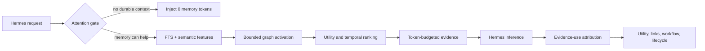

# Cortex Memory

**Memory that earns its place.** Cortex is a local-first, psychology-inspired memory and observability layer for AI agents. The current stable adapter targets [Hermes Agent](https://github.com/NousResearch/hermes-agent); the harness-neutral API and offline Sleep engine are developing on the `testing` branch.

Cortex is an engineering system, not a simulated brain. Psychology and neuroscience provide hypotheses; transparent benchmarks decide whether the software helps.


## Evidence at a glance

| Question | Measured result | What it means |
| --- | --- | --- |
| Can it find memory at scale? | **98.5–99.5% recall@6** from 100 to 2,000 synthetic memories. | The relevant fact was almost always in Cortex's first six results. |
| Does adaptive recall reduce Cortex context? | **21.7% fewer** approximate memory-context tokens than fixed verbose Cortex, with the same 93.3% labeled answer availability. | The attention gate and compact format avoided unnecessary memory text in this workload. |
| Did answers improve in a live paired run? | **6.7% → 96.7% exact-answer accuracy** across 90 pairs in additive mode. | Cortex made the labeled answer available; the built-in bounded snapshot usually could not hold it. |
| Is inference proven faster? | **No clear latency difference.** TTFT was 1,339 ms with Cortex and 1,337 ms built-in; the confidence interval crossed zero. | The proven benefit is memory capacity and answer availability, not raw model speed—yet. |


These are reproducible synthetic benchmarks, not a promise about every agent or vault. The live accuracy comparison intentionally tests beyond the built-in snapshot's capacity, and Cortex used 51.8% more median prompt tokens in that run to supply the missing evidence. Read the [method, raw results, and required caveats](docs/BENCHMARKING.md), or run the same tests on your own Hermes history.

## Why Cortex

Most agent memory systems optimize only for storing and finding text. Cortex also asks:

- Did this request need memory at all?
- Was the recalled memory actually used?
- Did it help, fail, or later prove wrong?
- Which memories are related or superseded?
- Which tool sequence has worked across multiple distinct tasks?
- Can a stale-memory decision be reversed?

The result is a bounded evidence layer for agents, plus a read-only Brain dashboard that makes its behavior inspectable.

## What 0.2 adds

- **Attention-gated recall:** `none`, `lean`, `focused`, `procedural`, and `deep` modes vary the memory count, token budget, graph depth, and tool evidence by request.
- **Transparent hybrid retrieval:** SQLite FTS5 precision plus dependency-free semantic features and bounded personalized graph activation. No embedding API or pre-inference LLM call.
- **Temporal recall:** current questions demote superseded facts; historical questions can retrieve the memory valid at a requested time.
- **Evidence-use attribution:** structured values, distinctive anchors, lexical evidence, and capped conceptual similarity prevent every retrieval from being rewarded.
- **Workflow learning:** Cortex learns repeated multi-step tool paths, not only single-tool success counts, and requires evidence from distinct tasks.
- **Reversible consolidation:** safe near-duplicates can fold behind a canonical memory and later be restored.
- **Adaptive lifecycle:** retention considers importance, confidence, trust, utility, uniqueness, frequency, and harm—not age alone.
- **Pruning-regret detection:** archived evidence can be surfaced in shadow mode or restored automatically.
- **Cognition dashboard:** live recall latency, estimated context tokens, abstention, lifecycle changes, tool workflows, and scientific field notes.

## Install the Hermes adapter in about a minute

Requirements: Hermes Agent, Python 3.10+, and SQLite with FTS5 (included in normal Python builds).

```bash
git clone https://github.com/jacobycoffin/cortex-memory.git
cd cortex-memory
HERMES_HOME="$HOME/.hermes" ./scripts/install_local.sh
hermes memory setup
```

Choose `cortex`, then restart the Hermes process so it initializes the provider. Hermes's curated `MEMORY.md` and `USER.md` files remain available; Cortex mirrors explicit built-in memory writes and adds adaptive retrieval.

If the `hermes` launcher is not on your VPS `PATH`, run the real environment directly:

```bash
~/.hermes/hermes-agent/venv/bin/python -m hermes_cli.main memory setup
```

See [Quickstart](docs/QUICKSTART.md) for migration, vault indexing, VPS services, rollback, and the first acceptance test.

## Try it

In one Hermes session:

> Remember that production deploys require the test suite and a health check.

In a fresh session:

> What checks do I require before production deploys?

Then inspect the evidence:

```bash
PYTHONPATH="$HOME/.hermes/plugins" python3 -m cortex search "production deploy checks"
PYTHONPATH="$HOME/.hermes/plugins" python3 -m cortex recall-stats
PYTHONPATH="$HOME/.hermes/plugins" python3 -m cortex audit
```

## Brain dashboard

```bash
PYTHONPATH="$HOME/.hermes/plugins" python3 -m cortex dashboard --no-open --port 8765
```

Open `http://127.0.0.1:8765`. The dashboard is read-only and includes:

- a draggable 2D physics map and orbitable 3D constellation;
- timeline, source, use-through, and tool-learning insights;
- a Cognition lab for recall modes, context tokens, latency, abstention, lifecycle repair, and workflows;
- plain-language health guidance and an inspectable memory index;
- six characterful themes with responsive text wrapping.

For a public hostname, terminate TLS at a reverse proxy and keep Cortex bound to localhost. The included systemd installer prints a temporary password once; the dashboard requires you to replace it at first sign-in. Cortex stores a PBKDF2 password hash rather than the readable password, uses signed 12-hour browser sessions, rate-limits failed logins, and revokes existing sessions after a password change. The [self-hosting guide](docs/DASHBOARD_HOSTING.md) shows generic Caddy, Nginx, Cloudflare Tunnel, DNS, reset, and verification examples for a hostname you control.

If the password is lost, generate a new one and restart the dashboard:

```bash
PYTHONPATH="$HOME/.hermes/plugins" python3 -m cortex dashboard-password --username cortex
systemctl --user restart cortex-dashboard
```

## How a recall works



The hot path is deterministic and local. Cortex never makes an extra LLM call to decide what to remember.

## Safety model

- no hard-delete operation;
- pruning and consolidation default to shadow previews;
- active → cold → archived transitions remain reversible;
- corrections preserve version history;
- derived memories identify evidence and become dirty when it changes;
- suspicious instruction-like memories are quarantined;
- likely secrets are redacted before storage;
- tool workflow guidance stores argument **keys**, not argument values;
- the dashboard exposes no write endpoint.

Read [Privacy and security](docs/PRIVACY.md) before exposing a dashboard or importing a vault.

## Configuration

`hermes memory setup` writes values under `plugins.cortex` in `$HERMES_HOME/config.yaml`.

| Setting | Default | Meaning |
| --- | ---: | --- |
| `db_path` | `$HERMES_HOME/cortex/cortex.db` | Local SQLite database |
| `auto_capture` | `true` | Capture conservative durable candidates |
| `top_k` | `6` | Maximum memories on the deepest recall plan |
| `token_budget` | `700` | Maximum approximate memory context budget |
| `retrieval_threshold` | `0.16` | Minimum non-pinned retrieval score |
| `adaptive_recall` | `true` | Skip or shrink recall by task |
| `compact_context` | `true` | Use the lower-token evidence format |
| `attribution_threshold` | `0.18` | Minimum evidence-use score for utility credit |
| `regret_mode` | `shadow` | `off`, detect only, or `restore` archived matches |
| `consolidation_mode` | `shadow` | `manual`, `shadow`, or reversible `apply` |
| `pruning_mode` | `shadow` | Preview or apply lifecycle transitions |
| `cold_after_days` | `90` | Base low-value cooling interval |
| `archive_after_days` | `180` | Base cold-memory archive interval |

Keep mutation modes in `shadow` until you have reviewed your own recall and pruning-regret data.

## Research and evidence

- [Brain and memory foundations](docs/BRAIN_FOUNDATIONS.md) — annotated primary sources, anatomy cautions, and the complete research-to-feature map.
- [Architecture](docs/ARCHITECTURE.md) — data model, retrieval, learning, repair, and trust boundaries.
- [Benchmarking](docs/BENCHMARKING.md) — fair baselines, paired live-model testing, uncertainty, and claim rules.
- [Testing](docs/TESTING.md) — automated and manual acceptance paths.

The July 13, 2026 additive benchmark on 90 paired questions / 500 synthetic memories measured 96.7% answer accuracy with Cortex versus 6.7% with Hermes's bounded built-in snapshot. Whole-agent TTFT was effectively tied; Cortex added prompt tokens in that pre-0.2 fixed-recall run. Treat it as a published baseline, not proof of universal speed or accuracy. Raw aggregates and methodology live in [`benchmark-results`](benchmark-results/).

On the local 0.2 retrieval run, Cortex reached 99.5% recall@6 at 2,000 synthetic memories with 34.0 ms p95 retrieval. The 500-memory mixed-workload ablation used 21.7% fewer approximate memory-context tokens than fixed verbose recall with no change in labeled answer availability. See the [0.2 retrieval report](benchmark-results/cortex-v020-retrieval.md) and [adaptive-context report](benchmark-results/cortex-adaptive-v020.md). These are local retrieval/prompt-preparation results; re-run the paired live-model benchmark before making a new inference-speed claim.

## Development

```bash
python3 -m unittest discover -v
python3 scripts/benchmark.py
python3 scripts/benchmark_compare.py --sizes 100,500,2000 --queries 200
python3 scripts/benchmark_adaptive.py --size 500 --memory-queries 30
```

Runtime dependencies are Python standard library only. See [Contributing](CONTRIBUTING.md) for change rules and required evidence.

## Project status

Cortex is experimental software. It is suitable for opt-in testing with backups and shadow lifecycle modes. Neural embeddings, autonomous generated summaries, and unconstrained self-modification are intentionally out of scope until simpler mechanisms show a measurable benefit.

MIT licensed. Cortex is an independent community project for Hermes Agent.
