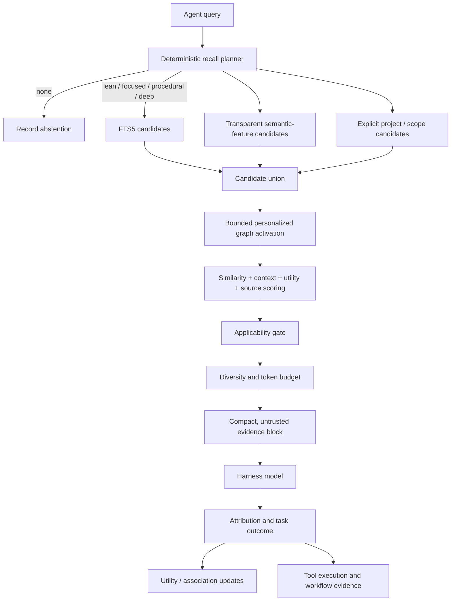

# Cortex architecture

Cortex Memory is a local evidence system around agent inference. Its architecture favors bounded work, inspectability, and reversible adaptation over an opaque "remember everything" pipeline. The core modules are harness-neutral; `__init__.py` also contains the included Hermes MemoryProvider adapter.

## Invariants

1. Events are evidence; beliefs are interpretations.
2. Retrieval is not truth and is not positive reinforcement.
3. Corrections preserve history.
4. Derived knowledge names its support.
5. Destructive maintenance is staged and reversible.
6. A tool procedure requires repeated evidence from distinct tasks.
7. The hot path must not require a network service or an extra LLM call.
8. Offline model reflection may propose, but never directly mutate, memory.

## Runtime flow

## Memory layers

| Layer | Representation | Behavior |
| --- | --- | --- |
| Working | recall plan, pending usage batch, short-lived exact-query cache | process-local and bounded; usage resolves after turn sync |
| Episodic | immutable `episodes`, `tool_executions`, episode memories | exact observations with deduplication |
| Semantic | semantic/decision/preference/identity memories and optional claims | versioned and time-aware |
| Procedural | procedure memories, tool stats, workflow stats | reinforced only after repeated outcomes |
| Prospective | protected prospective kind, explicit lifecycle state, and due time | dashboard tracks open, overdue, completed, and abandoned; notification delivery remains external |

This is functional decomposition, not a claim that a SQLite table is a hippocampus or cortex.

Schema 12 gives every durable memory an explicit applicability shape. `context_mode=standalone` means the text should remain understandable and usable without its original turn. `context_mode=context_dependent` requires at least one project/entity/scope/precondition/system/version field. Source context records where the fragment made sense; it does not itself make the memory true. Exact-text deduplication includes applicability, so the same sentence in two projects is not silently collapsed.

## Recall planner

`cognition.py` assigns the smallest plan justified by surface cues:

| Mode | Typical cue | Default ceiling |
| --- | --- | ---: |
| `none` | greeting or self-contained transformation | 0 tokens |
| `lean` | weak durable-context signal | up to 6 / ~620 with a stricter threshold |
| `focused` | personal context, decisions, current or historical fact | 6 / ~620 |
| `procedural` | tool, build, deploy, research, or operational task | up to 6 / ~620 plus tool evidence |
| `deep` | multi-hop relationship or temporal reasoning | 6 / ~680 and depth-2 graph |

These are conservative heuristics, not a semantic classifier. Every decision is counted in `recall_runs` and linked by task ID to the structured trace ledger.

When adaptive budget learning is enabled, a plan may be adjusted only after at least eight resolved outcomes for the same task type and mode. Pending outcomes and raw retrieval frequency do not count. Repeated ignored or harmful context can reduce the plan by 10–15%; consistently helpful, fully used context can increase it by at most 10%, always inside the configured ceiling. A broader mode-level fallback requires twice as much evidence.

## Candidate retrieval

Three independent local paths generate candidates:

- SQLite FTS5 with Porter stemming provides exact-term precision and BM25 ranking.
- `memory_features` stores inspectable tokens, crude stems, adjacent pairs, concept aliases, and low-weight character trigrams. It catches modest paraphrases and typos without claiming embedding-level semantics.
- indexed `memory_context_terms` lookup can surface project/task/precondition/system/version candidates even when their wording has no direct query overlap. Store writes, migration backfill, and connection-local raw-SQL triggers keep this index aligned without a newest-row scan cap.

The union becomes the seed set for a bounded personalized PageRank-style walk over explicit associations. The neighborhood is capped, the iteration count is fixed, and graph activation cannot bypass lifecycle-state checks.

Persistent associations are evidence-bearing records, not similarity labels. `edge_evidence` stores the evidence type, stable evidence key, plain-language explanation, optional task/source reference, and metadata behind each typed edge. Replaying the same evidence key does not inflate its weight or witness count. Shared task attribution, explicit vault wikilinks, structured claim conflicts, version lineage, approved consolidation, and independently witnessed Sleep replay are valid link sources. Token overlap by itself is not. Migration recovers only reasons supported by existing relational data; unverifiable legacy links remain in history and are excluded from the default map.

The provider may cache a retrieval result for a short bounded interval (45 seconds by default, 300 seconds maximum). Connection-local SQLite triggers invalidate the cache after material writes by the provider, while SQLite's `data_version` detects changes committed through another connection. This avoids adding a revision write to every memory transaction and remains compatible with raw SQLite clients. Cache hits still create their own recall record and pending usage batch, so speed does not erase evidence accounting.

## Scoring and selection

Ranking keeps these signals separate until the final score:

- lexical and feature relevance;
- phrase match and graph support;
- type-aware activation from recency and meaningful use;
- Bayesian-smoothed utility;
- confidence × source trust;
- time validity and supersession;
- importance and uniqueness;
- staleness and harmful-use penalties.
- project, goal, entity, scope, precondition, system, and version matches;
- context-specific historical usefulness and its observation count;
- contradiction risk, source-category reliability, and a memory-type prior.

Similarity is only part of the score. A context-dependent memory whose required scope, precondition, system, or version is unavailable is hard-gated below selection regardless of lexical or feature similarity. Selection then applies a minimum threshold, duplicate suppression, claim-family caps, type diversity, top-k, and the plan's token budget. A weak result can produce an empty evidence block.

## Storage decisions and context adaptation

Schema 14 records source type and quality flags for every assessed write in `memory_write_decisions`. The preflight estimates reuse value and durability, checks exact same-context duplicates, detects overlapping structured contradictions, and asks whether the text can be understood independently. Automatic capture ignores tool telemetry already represented by the execution/statistics ledger, sparse placeholders, transient automation status, and weak, unresolved, or under-scoped candidates. Explicit/trusted integration paths remain available, but their decision and warning reason are still inspectable.

`memory_context_outcomes` keeps one current, reversible row per task and selected memory. Its stable context key excludes session/thread identifiers and uses project, task type, scope, entities, preconditions, systems, and versions. Selected-but-unused evidence downweights the memory only in that matching context; repeated helpful or validated use raises it there. Dashboard label replacement or undo updates the row rather than accumulating irreversible credit. This component is observational evidence and is never described as causal.

## Structured memory tracing

Schema 11 adds two complementary records. `memory_traces` is the current task snapshot; `memory_trace_events` is the append-only event ledger that can be exported as JSONL. A retrieval event records the task goal, concise context summary, recall/abstention reason, queries, every bounded candidate, separate score components, final selection state, and an explicit selection or rejection reason. It stores operational decision summaries, not hidden model reasoning.

After task resolution, the same trace records attribution for every selected memory and rates it `Essential`, `Helpful`, `Neutral`, `Irrelevant`, `Misleading`, or `Harmful`. A selected-but-unused memory becomes `Irrelevant`; a used memory remains `Neutral` until an explicit outcome exists. Helpful, validated, corrected, and harmful outcomes update only evidence attributed to the answer. Storage decisions record whether a durable candidate was created, merged into an existing memory, quarantined, or ignored. The structured retrieval context connects the trace to later context-specific adaptation. The append-only events preserve the earlier decision even when a later outcome or dashboard undo changes the current snapshot.

`memory_trace_summary` reports attributed use among selected memories as observed selection precision. That is a retrieval diagnostic, not answer correctness or proof that memory caused the outcome.

## Metacognitive source monitoring

Retrieval relevance and memory reliability are separate judgments. After ranking, `metacognition.py` computes an inspectable pre-outcome probability from source provenance, memory confidence, source trust, currentness, direct match, outcome-backed utility, stale risk, dirty evidence, supersession, and prior harm. It records one of three proposed actions:

- `use` for sufficiently supported evidence;
- `verify` for plausible but weak, stale, inferred, or sparsely calibrated evidence;
- `abstain` below the conservative reliability boundary.

Every judgment is stored in `metacognitive_predictions` before its outcome. Explicit helpful/validated outcomes are positive calibration labels; harmful/corrected outcomes are negative labels. Used, ignored, pending, and withheld records remain visible but do not pretend to be correctness labels.

The default `metacognition_mode=shadow` records what the policy would do without changing the evidence block. A requested `enforce` mode remains effectively shadow until the database has at least 50 explicit labels, acceptable Brier and expected-calibration error, and enough low-risk `use` decisions. Passing the gate permits a controlled enforcement trial; it does not prove introspection. Calibration learns conservatively within probability bands, preferring task-and-source evidence and requiring progressively larger samples before task-wide or global fallback. Retrieval frequency alone never changes the probability.

## Local benchmark ledger

The dashboard's fixed synthetic benchmark runs outside the production retrieval database, one background job at a time. `benchmark_runs` persists progress, suite version, host-level aggregate metrics, the transparent score components, and the raw synthetic report. The dashboard compares only compatible completed versions and keeps local retrieval overhead separate from model or provider latency.

The private real-history path begins with one auditable `task_outcome_labels` decision over memories actually attributed to a task. Positive labels maintain a local `evaluation_cases` row containing the private query and relevant IDs. The dashboard evaluates fixed and adaptive retrieval over the same cases in a disposable consistent snapshot, then persists only a sanitized `evaluation_runs` report. The Outcome Lab exposes label coverage as a driver, observed helpfulness as the primary descriptive KPI, and calibration, selective risk, context size, latency, and pruning regret as guardrails.

The evidence hierarchy keeps level one raw active/cold evidence and level two memories with explicit `memory_dependencies`. Level three contains extractive summary candidates whose every claim names a source memory. Candidates remain outside recall until an authenticated operator approves them; approval creates one protected summary memory with dependencies to every cited source. Sleep proposals are rendered as hypotheses with an exposure flag and later task outcomes; tool and workflow suggestions create `tool_guidance_exposures` rows so follow-through can be compared without calling it causal.

Schema 10 adds a shared research ledger. `controlled_experiments` and `recall_experiment_assignments` record balanced randomized assignment before recall. `agent_task_observations` keeps recall condition, context, timing, tool results, correction signals, and outcomes under the existing task ID. Explicit dashboard labels update that row and the assignment; inferred conversation feedback has a distinct source. `sleep_trials` and `sleep_trial_items` record matched treatment/control proposals. Summary candidates, prospective items, and reconsolidation events preserve citations, state transitions, and old/new version identity respectively.

## Feedback and attribution

Every injected set becomes a pending usage batch. After the answer, Cortex credits only memories with evidence of use:

1. an exact structured object value;
2. distinctive paths, URLs, identifiers, or numeric anchors;
3. meaningful token overlap;
4. capped conceptual support.

Conceptual similarity alone cannot produce high-confidence credit. Later user feedback can mark attributed memories helpful or harmful. Selected-but-unused evidence is resolved as ignored.

## Tool memory

Each completed tool call records a redacted episode: task family, tool name, argument-key names, normalized success/error, timestamp, and session. It does not put argument values into procedural guidance.

`tool_workflows` preserves ordered multi-step traces. `tool_workflow_stats` reinforces a sequence only after the same task family and workflow succeeds across at least two distinct task descriptions. Workflow guidance is similarity-ranked within the current task type.

## Consolidation and lifecycle

Near-duplicate consolidation chooses a high-value canonical memory, adds a `consolidates` relation, and moves redundant members to `cold`. `consolidation_members` stores each prior state so `undo-consolidation` can restore it.

Lifecycle maintenance calculates retention from importance, confidence, trust, currentness, uniqueness, meaningful use, positive outcomes, harm, and duplicate pressure. Lack of retrieval is never sufficient on its own. Legacy tool-memory duplicates can be archived because their raw evidence remains in the tool ledger; sparse unused placeholders and transient success-status episodes can only be cooled for review. Protected identity, preference, and prospective memories are excluded from automatic pruning. State changes are written to `lifecycle_events`.

Archived evidence is excluded from normal retrieval. A shadow search can detect a high-scoring archived match as pruning regret; `regret_mode=restore` can return it to active state. There is no hard-delete API.

The dashboard's Review Inbox is the operator boundary for uncertain memory mutations. It joins open Sleep proposals, active contradictions, unsupported agent inferences, and unlabeled attributed tasks into one decision-ready queue. Cards show full memory text and metadata, proposal rationale, preserved witnesses, use/outcome history, and the consequence of every action. Link approval writes `operator_review` edge evidence; denial closes only the proposal. Archive and trash use lifecycle states rather than deletion, and proposal decisions can be undone from their recorded before-state.

`operator_review_decisions` is an append-only review ledger for these choices. It stores the item key, action, required reason code, optional explanation, actor, before-state, applied effect, typed signal, and explicit `decision_scope`. `item_only` mutates only the current review target; `exact_duplicates` can extend a single-memory action to eligible active/cold copies with the same normalized content, context, and source identity; neither scope enters policy compilation. Only `policy_evidence`, selected in the UI as **Teach Kaya too**, is aggregated into pruning, linking, retrieval, or admission standards. A single decision never changes a global threshold or policy automatically.

## Operator policy training

The Feedback Compiler maps opted-in `policy_evidence` reviews only onto four bounded core levers: automatic write admission, independent-witness requirements for Sleep links, retrieval-score adjustment, and lifecycle-retention adjustment. It groups evidence by an inspectable selector such as memory kind plus source category; it does not infer arbitrary executable code or edit Python.

`policy_candidates` stores the proposed selector, adjustment, supporting and opposing review IDs, independent-context count, consistency, replay result, shadow progress, and stage. Five supporting reviews with at least 80% agreement permit an operator-evidence counterfactual replay. A passing rule then waits for three new matching reviews in shadow mode. Only an authenticated operator can promote a ready candidate. Core-wide promotion has the stronger gate of 15 supporting reviews across at least three contexts.

`policy_versions` is the only operator-training table read by the live core. Active versions are matched deterministically and contribute bounded adjustments; they cannot bypass applicability gates, hard relevance requirements, state exclusions, or the proposal-only lifecycle boundary. `policy_events` records compilation, replay, shadow start, promotion, rejection, and rollback. Rolling back deactivates the version without deleting the proposal, evidence, or earlier outcomes.

## Offline Sleep cycle

`sleep.py` runs outside normal agent inference. A cycle selects only old, unprocessed episodes and resolved usage tasks, replays them through local graph-free retrieval, and stores hashed witness evidence. An association requires at least two independent session/task witnesses; one burst or raw retrieval count cannot qualify it.

The deterministic pass also produces structured interference, stale weak-edge, lifecycle, near-duplicate, and dependency-repair proposals. Shadow mode records observations only. Explicit `--mode apply --apply` can add or strengthen a `sleep_replay` edge, reduce an eligible weak association by five percent, or commit a reversible lifecycle transition. `sleep_edge_changes` and `sleep_state_changes` preserve prior values for `sleep-undo`. Neither mode hard-deletes evidence.

Optional reflection is last and defaults to zero tokens. When an operator supplies a provider, model, key environment-variable name, and per-run ceiling, Cortex sends a bounded set of already-sanitized proposal memories. The response must match the typed JSON contract and may reference only submitted memory IDs. Valid output becomes a `reflection_*` proposal; it cannot create a memory, relation, lifecycle change, or fact. Provider failure leaves deterministic Sleep results intact.

## Trust boundaries

- SQLite is local to `$HERMES_HOME/cortex` and uses WAL mode.
- memory text is sanitized before write;
- likely secrets are redacted and prompt-like instructions quarantined;
- evidence is labeled fallible and never presented as instructions;
- the dashboard binds to localhost; memory and cognition reads stay read-only, while authentication and opt-in guided review use narrowly scoped, same-origin POST endpoints;
- guided review writes are disabled unless `CORTEX_DASHBOARD_REVIEWS=1`; enabled actions require a complete authenticated session, an explicit confirmation, bounded request bodies, lifecycle/version history, and an audit record;
- public routing requires TLS and authentication at or before the dashboard;
- vault indexing is incremental, reads source notes without modifying them, and revises a stable memory ID plus version history when an existing section changes or returns after removal;
- remote Sleep reflection is disabled by default and, when enabled, crosses the local trust boundary with selected memory text.

## Schema evolution

Schema 4 added `memory_features`, `recall_runs`, `lifecycle_events`, `pruning_regret`, `consolidation_runs`, `consolidation_members`, `tool_workflows`, and `tool_workflow_stats`.

Schema 5 adds `recall_budget_observations` plus the connection-local revision and external `data_version` invalidation needed by safe caching. Opening an older database creates and backfills required structures without deleting existing memories.

Schema 17 adds explicit item-only, exact-duplicate, and policy-evidence reach to every operator review. Existing pre-schema-17 decisions preserve their former training-evidence meaning during migration; new reviews default to item-only. Schema 16 adds compiled `policy_candidates`, active and rolled-back `policy_versions`, and append-only `policy_events` for the guided Kaya Training workflow. Schema 15 adds the reversible `operator_review_decisions` ledger used by the unified Review Inbox. Schema 10 adds controlled assignments, agent-task observations, matched Sleep trials, cited summary review, prospective state, and reconsolidation events. Schema 9 added auditable task labels, private evaluation cases and run ledgers, and tool-guidance exposure records. Earlier Sleep, metacognition, and benchmark tables remain additive; migration creates new tables without rewriting existing memories or edges.
