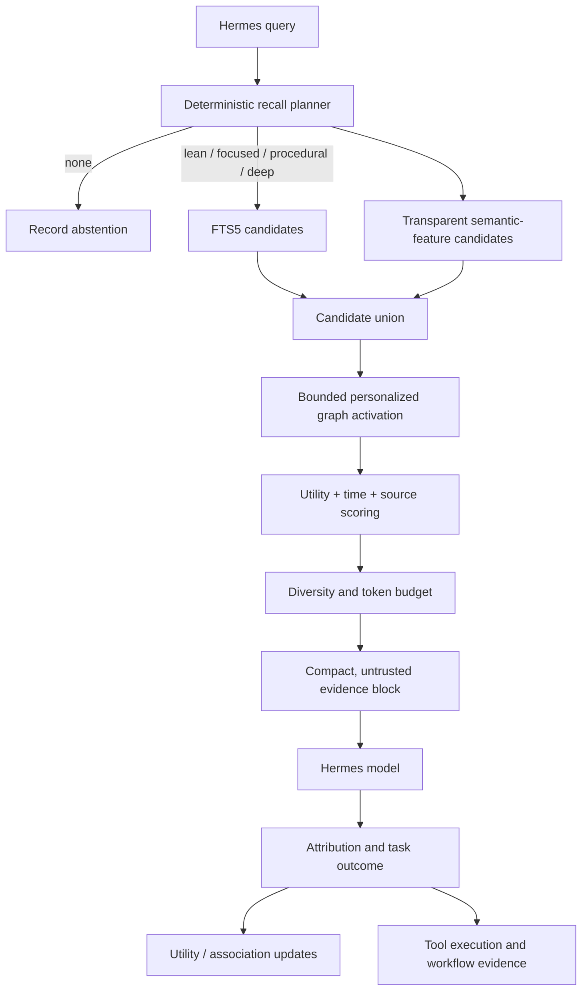

# Cortex architecture

Cortex is a local evidence system around Hermes inference. Its architecture favors bounded work, inspectability, and reversible adaptation over an opaque "remember everything" pipeline.

## Invariants

1. Events are evidence; beliefs are interpretations.
2. Retrieval is not truth and is not positive reinforcement.
3. Corrections preserve history.
4. Derived knowledge names its support.
5. Destructive maintenance is staged and reversible.
6. A tool procedure requires repeated evidence from distinct tasks.
7. The hot path must not require a network service or an extra LLM call.

## Runtime flow

## Memory layers

| Layer | Representation | Behavior |
| --- | --- | --- |
| Working | prefetch cache, recall plan, usage batch | session-scoped, bounded, cleared after turn sync |
| Episodic | immutable `episodes`, `tool_executions`, episode memories | exact observations with deduplication |
| Semantic | semantic/decision/preference/identity memories and optional claims | versioned and time-aware |
| Procedural | procedure memories, tool stats, workflow stats | reinforced only after repeated outcomes |
| Prospective | protected prospective kind and validity fields | retained; scheduling remains external |

This is functional decomposition, not a claim that a SQLite table is a hippocampus or cortex.

## Recall planner

`cognition.py` assigns the smallest plan justified by surface cues:

| Mode | Typical cue | Default ceiling |
| --- | --- | ---: |
| `none` | greeting or self-contained transformation | 0 tokens |
| `lean` | weak durable-context signal | up to 6 / ~620 with a stricter threshold |
| `focused` | personal context, decisions, current or historical fact | 6 / ~620 |
| `procedural` | tool, build, deploy, research, or operational task | up to 6 / ~620 plus tool evidence |
| `deep` | multi-hop relationship or temporal reasoning | 6 / ~680 and depth-2 graph |

These are conservative heuristics, not a semantic classifier. Every decision is recorded in `recall_runs` for later calibration.

## Candidate retrieval

Two independent local indexes generate candidates:

- SQLite FTS5 with Porter stemming provides exact-term precision and BM25 ranking.
- `memory_features` stores inspectable tokens, crude stems, adjacent pairs, concept aliases, and low-weight character trigrams. It catches modest paraphrases and typos without claiming embedding-level semantics.

The union becomes the seed set for a bounded personalized PageRank-style walk over explicit associations. The neighborhood is capped, the iteration count is fixed, and graph activation cannot bypass lifecycle-state checks.

## Scoring and selection

Ranking keeps these signals separate until the final score:

- lexical and feature relevance;
- phrase match and graph support;
- type-aware activation from recency and meaningful use;
- Bayesian-smoothed utility;
- confidence × source trust;
- time validity and supersession;
- importance and uniqueness;
- staleness and harmful-use penalties.

Selection then applies a minimum threshold, duplicate suppression, claim-family caps, type diversity, top-k, and the plan's token budget. A weak result can produce an empty evidence block.

## Feedback and attribution

Every injected set becomes a pending usage batch. After the answer, Cortex credits only memories with evidence of use:

1. an exact structured object value;
2. distinctive paths, URLs, identifiers, or numeric anchors;
3. meaningful token overlap;
4. capped conceptual support.

Conceptual similarity alone cannot produce high-confidence credit. Later user feedback can mark attributed memories helpful or harmful. Selected-but-unused evidence is resolved as ignored.

## Tool memory

Each completed tool call records a redacted episode: task family, tool name, argument-key names, normalized success/error, timestamp, and session. It does not put argument values into procedural guidance.

`tool_workflows` preserves ordered multi-step traces. `tool_workflow_stats` reinforces a sequence only after the same task family and workflow succeeds across at least two distinct task descriptions. Workflow guidance is similarity-ranked within the current task type.

## Consolidation and lifecycle

Near-duplicate consolidation chooses a high-value canonical memory, adds a `consolidates` relation, and moves redundant members to `cold`. `consolidation_members` stores each prior state so `undo-consolidation` can restore it.

Lifecycle maintenance calculates retention from importance, confidence, trust, currentness, uniqueness, meaningful use, positive outcomes, harm, and duplicate pressure. Protected identity, preference, and prospective memories are excluded from automatic pruning. State changes are written to `lifecycle_events`.

Archived evidence is excluded from normal retrieval. A shadow search can detect a high-scoring archived match as pruning regret; `regret_mode=restore` can return it to active state. There is no hard-delete API.

## Trust boundaries

- SQLite is local to `$HERMES_HOME/cortex` and uses WAL mode.
- memory text is sanitized before write;
- likely secrets are redacted and prompt-like instructions quarantined;
- evidence is labeled fallible and never presented as instructions;
- the dashboard binds to localhost and exposes GET-only inspection endpoints;
- public routing requires TLS and authentication at or before the dashboard;
- vault indexing is incremental and reads source notes without modifying them.

## Schema 4 additions

`memory_features`, `recall_runs`, `lifecycle_events`, `pruning_regret`, `consolidation_runs`, `consolidation_members`, `tool_workflows`, and `tool_workflow_stats`. Opening an older database creates and backfills the new structures without deleting existing memories.
