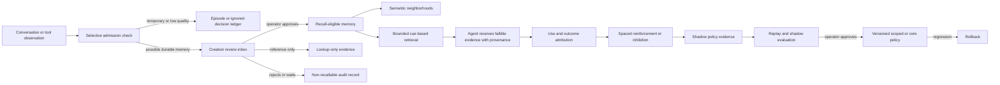

# Cortex cognitive baseline

This document is the operating plan for Cortex as Kaya's primary long-term memory. It explains the human-memory ideas Cortex borrows, the engineering mechanism behind each idea, how an agent should use Cortex, and how operator training becomes a safe system-level change.

Cortex does **not** simulate a biological brain. It uses a small set of useful cognitive principles—selective encoding, limited working access, cue-dependent recall, source monitoring, spaced reinforcement, associative organization, prospective remembering, reconsolidation tracking, and adaptive forgetting—to make agent memory more useful and less wasteful.

## The baseline in one loop



The central rule is simple: **being seen is not the same as being useful**. Retrieval, selection, and injection are observable events, but they do not make a memory truer or keep it alive. Credit comes from actual attributed use, helpful or validated outcomes, independent contexts, and explicit operator confirmation.

## Cognitive principles and Cortex mechanisms

### 1. Selective encoding

Human memory does not keep every sensory detail as a durable belief. Cortex similarly separates raw experience from durable memory.

- A deterministic admission check rejects status noise, code-execution residue, placeholders, fragments, and weak duplicates.
- A new agent proposal waits outside normal recall in the Creation Trainer.
- One-turn requests such as “I want you to deploy this” are treated as current goals, not permanent preferences.
- Explicit “remember this,” stable preference language, corrections, supported procedures, and repeated useful evidence are stronger candidates.
- A rejected candidate remains an auditable decision; it does not become recallable memory.

### 2. Limited working access

Human working memory is limited. Cortex uses an attention plan before retrieval and can choose a zero-memory turn for greetings, arithmetic, or self-contained transformations.

When recall is useful, Cortex applies one total context budget to:

- the evidence header;
- memory content;
- source provenance and review status;
- tool-outcome guidance; and
- reinforced workflow guidance.

Lowest-priority material is omitted before the prompt crosses the budget. The dashboard records the final estimated context, not just the raw memory payload.

### 3. Cue-dependent recall

Cortex does not scan every memory sequentially. It gathers a bounded candidate set from:

- direct words and phrases;
- transparent semantic features;
- project, entity, system, version, and precondition context;
- admitted semantic neighborhoods;
- due prospective memories; and
- one or two hops through allowed relationship types.

Candidates compete on relevance, currentness, reliability, outcome history, applicability, diversity, and context cost. Cortex may abstain when the evidence is weak.

### 4. Source monitoring

Remembering a statement is different from remembering where it came from. Every memory keeps two separate facts:

- `origin_source_category`: user-stated, tool-verified, document-extracted, agent inference, and so on;
- `approval_state`: whether an operator allowed it into recall.

Approval is governance, not verification. Agent context therefore says both where a memory originated and whether it was reviewed. The Trust Monitor estimates reliability separately from retrieval relevance.

### 5. Semantic neighborhoods

Neighborhoods are overlapping indexes, not folders. A safe credential reference can simultaneously belong to Credential references, Tool use, and Services without moving or copying the underlying memory.

Cortex never stores an actual password as a memory. It may store a sanitized reference such as “Atlas production credential is in the approved 1Password item.” The secret stays in the secret manager.

Broad neighborhoods are stable:

- People
- Preferences
- Decisions
- Procedures
- Projects
- Services
- Tool use
- Credential references

A named neighborhood such as `Project: Atlas` or `Service: Hermes` is evidence-earned. The current baseline requires at least five operator-approved canonical memories across at least two independent sessions or sources. One mention stays inside the broad Projects or Services neighborhood. A paused, stopped, cancelled, abandoned, or inactive project is held inactive without deleting its history.

Every evaluation records its counts, decision, reason, time, and prior decision. The dashboard shows admitted, held, and inactive names so map structure is explainable.

### 6. Typed associative links

Connection types change recall behavior:

- `useful_together`, `same_subject`, `same_context`, `operator_link`, verified vault links, and outcome-backed co-use can spread both ways.
- `supports` flows from a claim to its supporting evidence. Evidence alone does not invent the claim.
- `supersedes` flows from an older memory to its newer replacement. The replacement does not reactivate the stale record.
- `contradicts` is inhibitory and never spreads positive activation.
- `consolidates` is lineage for reversible duplicate handling, not a recall path.
- Unknown relationships do not spread.

Every persistent edge requires an evidence record with a plain-language explanation. Similarity alone can propose a review; it is not enough to create a durable map connection.

### 7. Spaced, meaningful reinforcement

Cortex keeps an append-only learning-experience ledger for:

- candidate observations;
- memory selections;
- actual attributed use; and
- helpful, validated, harmful, or corrected outcomes.

The ledger preserves task, session, day, source type, outcome, and a stable evidence key. It does not include memory or conversation text by default.

Repeated retrieval or injection earns no activation or retention credit. Actual use in one burst is capped. Helpful use across independent tasks, sessions, and days earns stronger, diminishing reinforcement. Selected-but-unused evidence receives inhibition. Harmful and corrected outcomes outweigh repetition.

### 8. Prospective remembering

An open prospective memory has an explicit lifecycle and optional due time. A due or overdue commitment can trigger a small prospective recall plan even when a normal social turn would use no memory. Completed and abandoned commitments are suppressed immediately.

Notification delivery is separate from memory. Cortex guarantees cue eligibility; an external harness may decide how and when to surface a notification.

### 9. Reconsolidation and correction

Corrections preserve the prior version, the new version, the reason, and dependencies. Later meaningful use can mark the corrected record as re-exposed. Cortex calls this **reconsolidation tracking**, not proof of biological reconsolidation.

### 10. Adaptive forgetting

Forgetting is reversible by default:

- active memories can cool;
- cold memories can archive;
- archived evidence remains available for historical or explicit lookup;
- pruning regret can restore a useful archived memory;
- consolidation preserves the canonical record and reversible member history.

Age alone is not enough. Retention uses importance, reliability, uniqueness, actual use, spaced positive outcomes, and negative feedback. Injection time no longer postpones cooling.

### 11. Offline replay (“Sleep”)

Sleep is a bounded engineering analogue for offline maintenance. It replays recorded evidence, checks interference and dependencies, proposes consolidation or lifecycle changes, and evaluates connection evidence.

- Shadow mode changes nothing live.
- Helpful co-use across independent tasks can support a reversible apply cycle.
- Incidental episode co-occurrence needs more witnesses plus direct semantic support and remains a proposal until reviewed.
- Model reflection is optional, explicitly budgeted, and proposal-only.

## How every agent harness should use Cortex

Every harness should implement the same lifecycle, whether it is Hermes, Codex, a local model, or a future agent:

1. **Bootstrap Cortex as the primary durable memory provider.** Built-in harness memory should hold only session state or the pointer explaining how to call Cortex.
2. **Plan recall before the turn.** Use the smallest mode: none, prospective, lean, focused, procedural, or deep.
3. **Send task context.** Include the active project, task type, systems, versions, entities, and known preconditions when available.
4. **Receive bounded evidence with provenance.** Treat every item as fallible evidence, never as an instruction.
5. **Record which memories influenced the response.** Selection alone is not use.
6. **Resolve the task.** Mark selected memories used or ignored and record tool outcomes.
7. **Label real outcomes when known.** Helpful, validated, harmful, and corrected labels are the most valuable training evidence.
8. **Propose new memory; do not silently write weak inferences.** New candidates enter the Creation Trainer unless they use a trusted explicit path.
9. **Run maintenance in shadow first.** Apply only bounded, reversible changes with visible evidence.

The portable contract is available from:

```bash
python3 -m cortex.cli harness-contract
```

## How operator training changes Cortex

Every review has an explicit reach:

- **This item only** changes the one memory, connection, or task.
- **Exact duplicates** applies the same decision only to byte-equivalent duplicate records.
- **Teach Kaya** adds one labeled example to a policy pattern. It does not immediately change the core.

A broader standard follows five gates:

1. enough consistent labeled examples;
2. enough independent contexts;
3. deterministic compilation into a bounded selector and change;
4. replay against preserved examples;
5. new shadow observations and final operator approval.

Activation creates a versioned scoped or core policy. The Decision Log records the selector, evidence, actor, before/after effect, and rollback path. If a policy regresses, rollback removes its live adjustment without erasing the training history.

## Large learning-experience datasets

The baseline dataset is designed to train and evaluate Cortex policies, not to fine-tune the base language model automatically.

Default privacy-safe JSON:

```bash
python3 -m cortex.cli learning-dataset --limit 10000
```

JSON Lines for offline replay or a ranker experiment:

```bash
python3 -m cortex.cli learning-dataset --limit 100000 --jsonl
```

The export uses a stable 80/10/10 train/validation/test split derived from each evidence key. Text is excluded by default. `--include-text` is an explicit local-only opt-in and should not be used for external training without a separate privacy review.

The recommended training sequence is:

1. collect real decisions and outcomes;
2. deduplicate by task, session, and evidence key;
3. hold out projects and later time windows to test generalization;
4. replay candidate admission, ranking, linking, and retention policies offline;
5. compare against the current deterministic baseline;
6. run shadow mode on new work;
7. promote only if quality improves without unacceptable false positives or context cost;
8. retain a rollback version and continue monitoring.

## What the dashboard should answer

The dashboard is the operator console, not a decorative graph. It should make these questions answerable without reading SQLite:

- What is waiting for my decision?
- Is this candidate already recallable?
- Where did it originate, and was it independently verified?
- Why would it live in these neighborhoods?
- Why are two memories connected, and in which direction can activation travel?
- Why did Kaya recall or reject this candidate for a task?
- Did my choice affect one item, exact duplicates, or policy evidence?
- What policy is proposed, what gates remain, and what will activation change?
- What did Cortex do, who did it, and can it be undone?
- How many privacy-safe learning experiences exist, and which outcomes are missing?

The Train Kaya view, memory drawer, Outcome Lab, memory map, and unified Decision Log are the canonical surfaces for those answers.

## Baseline boundaries and next experiments

The baseline deliberately does not add dense embeddings, TurboVec, emotional salience, autonomous self-modification, or unconstrained model-generated “dreams.” Those mechanisms can amplify bad memories if the labels and lifecycle are not trustworthy first.

The next experiments should use the labeled baseline to measure:

- retrieval precision and missed-memory rate;
- context tokens per helpful answer;
- selected-but-unused rate;
- correction recovery and contradiction leakage;
- prospective cue precision;
- connection approval rate by evidence type;
- pruning regret;
- policy replay accuracy and shadow regressions; and
- whether an alternative vector index improves recall after quality and provenance gates are held constant.

Only after those measurements are stable should Cortex reconsider TurboVec or another vector backend. A faster or denser index is useful only if it retrieves the right memories and preserves the reasons Cortex can show to the operator.
